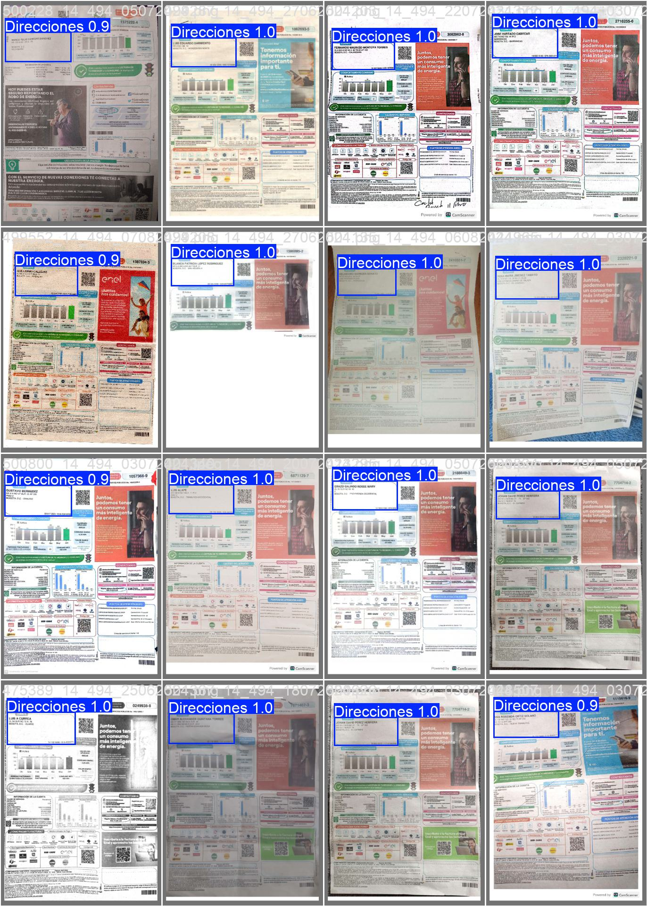
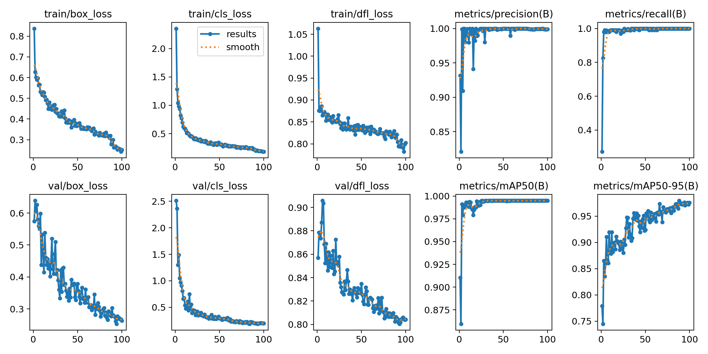

# Proyecto YOLOv8 y OCR para Reconocimiento de Texto en Imágenes de Enel

YOLO (You Only Look Once) es una red neuronal convolucional (CNN) diseñada específicamente para la tarea de detección de objetos. Su estructura combina características de las redes convolucionales para extraer información de las imágenes con un diseño eficiente que permite procesar la tarea de detección en una sola pasada.

Este proyecto implementa un modelo YOLOv8 personalizado, diseñado para detectar regiones específicas en imágenes proporcionadas por los recibos del servicio público de energia de la empresa  Enel, seguido de la extracción de texto desde las regiones detectadas utilizando OCR (Tesseract).

## 🚀 Funcionalidades
1. **Entrenamiento de YOLOv8**: 
   - El modelo YOLOv8 se entrena con un conjunto de datos personalizado para detectar objetos o áreas de interés en imágenes.
   
2. **Detección e Inferencia**:
   - El modelo entrenado realiza predicciones en imágenes nuevas y guarda las regiones detectadas.

3. **Extracción de Texto (OCR)**:
   - Se utiliza Tesseract para aplicar OCR a las áreas detectadas por YOLOv8 y convertir las imágenes en texto.

4. **Mejoras de Imagen**:
   - Procesamiento adicional de las imágenes recortadas (redimensionamiento, conversión a escala de grises, y ajuste de contraste) para mejorar la precisión del OCR.

## 📂 Estructura del Proyecto
- `data.yaml`: Configuración del conjunto de datos para el entrenamiento.
- `images/`: Carpeta que contiene imágenes de entrada para entrenamiento y predicción.
- `runs/detect/`: Carpeta donde se almacenan los resultados del modelo YOLOv8.
- `prueba_recorte.png`: Ejemplo de una región recortada para aplicar OCR.

## 📊 Resultados

### Ejemplo de Predicciones

### Métricas del Modelo

## 🛠️ Requisitos
- Python 3.8+
- Librerías:
  - [ultralytics](https://github.com/ultralytics/ultralytics)
  - [roboflow](https://github.com/roboflow-ai/roboflow-python)
  - OpenCV
  - Tesseract-OCR
  - PIL (Pillow)

